# JMeter Test Explorer
## Introduction
### Scope and Purpose
JMeter Test Explorer is a Visual Studio plugin created for directly running JMeter tests present in your Solution and visualizing the results. JMeter Test Explorer can be used to analyze and measure the performance and load functional behavior of web application and variety of services.
The main purpose is to assist developers in performing load and performance testing. Later they can publish the results as Load and Performance test results of the functionality developed. This plugin will assist developer to increase productivity and validate the workflow.
This user manual will walk through the setup and usage of the plugin.

### Prerequisites
JMeter is pure Java desktop application, it requires a fully compliant JVM 6 or higher. The two main prerequisites needed are: 
1.	Java version 8 or 9 major version with latest minor version installed of respective major version.
https://www.java.com/en/download/
2.	Latest JMeter binaries. Download and unzip the source or binaries into your local machine.
https://jmeter.apache.org/download_jmeter.cgi

## Process/Workflow
### JMeter Workflow
Here, in the below diagram a very brief overview of how JMeter works is explained.

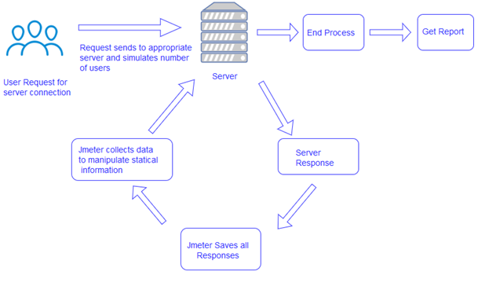

JMeter sends requests to a target server by simulating a group of users. Subsequently, data is collected to calculate statistics and display performance metrics of the target server through various formats. 
To understand JMeter workflow in details please visit any JMeter tutorial series or website.

### JMeter Test Explorer Plugin Workflow
JMeter Test Explorer plugin for Visual Studio executes the JMX files created for performing Load and Performance Testing of the Services (mainly Web Applications).
JMX files needs to be included in the Solution project after which the plugin will scan the entire solution for existing JMX files and provide you option for directly executing the tests.
On execution the results are displayed on the window inside the Visual Studio as well the CSV of the output is generated in the path where the input JMX file is present.
The output CSV files can then be used for variety of purposes.
Please find below diagram displaying the overall workflow of the plugin.

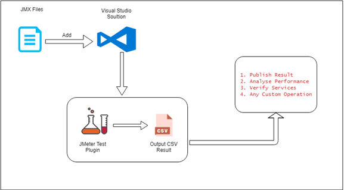

## Setup
To setup JMeter Test Explorer please follow below steps:
1.	Get the VSIX setup from the shared path/ Download plugin from Visual Studio Market Place.
2.	Close all the instances of running Visual Studio.
3.	Install the plugin setup and start the Visual Studio.
4.	Installed plugin can be found under Tools menu.

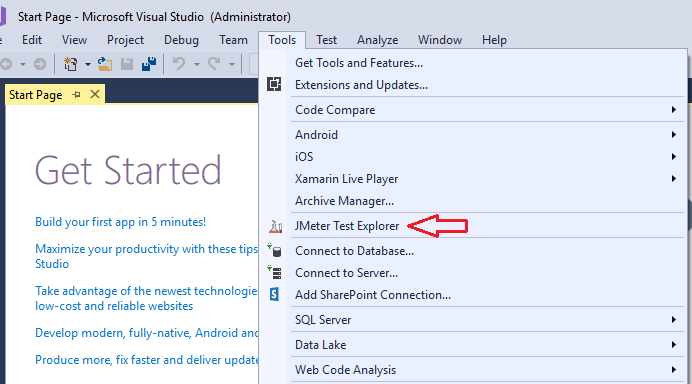

5.	On clicking the plugin a prompt will open and ask for the path to “jmeter.bat" file which will be subsequently used to run test cases. This jmeter.bat file is present inside the JMeter binaries bin folder which was fetched in the prerequisite step ({Device Folder}\apache-jmeter-{version}}\bin).

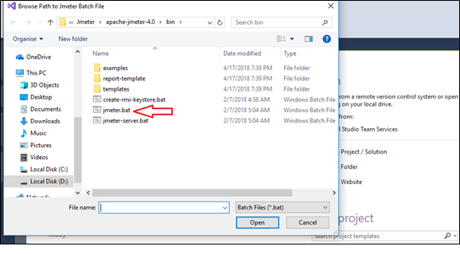

6.	On selecting the JMeter batch file path actual JMeter Test Explorer tool box will be displayed.

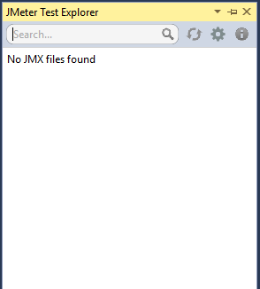

##	JMeter Test Explorer Plugin Features
JMeter Test Explorer comes with features which makes it visually interactive to configure and use it. This section will describe the feature which comes with the plugin.
Each section in the image below is assigned a numeral. Working/Description of each is detailed after the image.

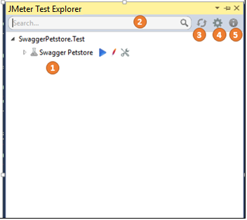

1.	This space contains the list of the JMX present in the solution. Entire solution is scanned for the JMX files and then listed in a hierarchical view in this space.
2.	**Search Box**: User can search for the JMX file with its name. This search feature is an interactive search box, so list filters as and when characters are typed.
Currently search filter work on the typed characters in the search with the Test Name present in JMX file.
3.	This **Refresh** icon refreshes the list by rescanning the entire solution again for the JMX files if any new file is added/deleted/modified.
4.	**Settings** icon opens a context menu which contains the plugin’s configurable menu items.

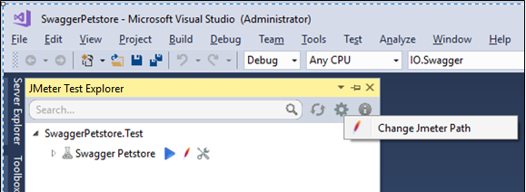

- **Change JMeter Path**: This feature can be used to change the batch file path for the JMeter.
If user wants JMeter executables path is changed it needs to be updated for the plugin to work as well. On clicking this menu item a prompt is opened which contains the current path and version of JMeter being used by the plugin. User can change the path by clicking Change button and browse the new path.

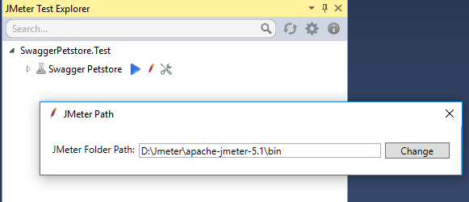

5.	 **About** opens a prompt window which displays all the details for the plugin. This details includes plugin name, version, product details etc.

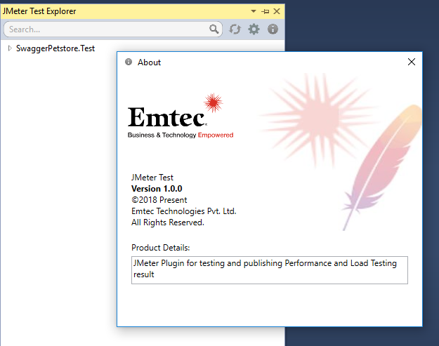

##	Demo
For demonstrating the actual use of JMeter Test Explorer we have used Swagger Petstore as sample API.
To check out more about Swagger petstore please visit below link:
https://petstore.swagger.io/

And if you want to get the source code and run this solution locally, you can get it from below Github repository
https://github.com/swagger-api/swagger-codegen/tree/master/samples/server/petstore/aspnetcore

### Visual Studio Solution Overview
To mimic the actual use case behavior copy the Visual Studio Solution(JMXTest) given in the repository above and open it . Below is the image displaying the Solution structure:

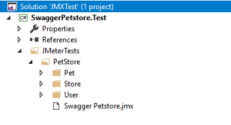

###	API and JMX Files Description
Swagger petstore solution has 3 API controllers in it which all has their individual actions. These 3 controllers are:
1.	PetAPI
2.	StoreAPI
3.	UserAPI

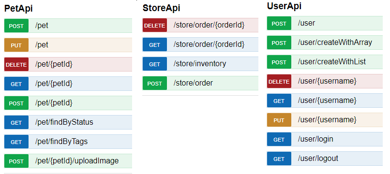

We have created JMXs for testing out these controllers. JMX files that we will be using here is created in the hierarchical structure. Below is the expanded view of JMeterTests folder. All the test cases will be tested for the globally available endoint (https://petstore.swagger.io/v2) in the JMX files,

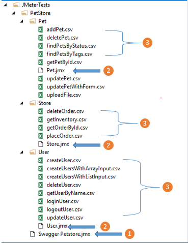

1.	**Swagger Petstore.jmx**: This is the root JMX for the entire API. It is the main fragment which contains child fragments i.e. ThreadGroups (API endpoints).
We are going to run this JMX and which runs the internal JMXs which are referred in this main fragment.
2.	**User.jmx, Store.jmx & Pet.jmx**: These are child fragments to the main fragment. Basically the endpoints are segregated so that they can be re-used and managed independently.
3.	**CSV Files**: The csv files present inside child fragments folders contains the test data for the individual endpoints present inside the child fragments. This data is then used by the JMeter to perform Load and Performance test.

### JMeter Test Explorer

JMeter Test Explorer scans through the solution and creates the same hierarchical structure for the JMXs as present in the folder. In general the logical hierarchical arrangement for a JMX is in the below format:

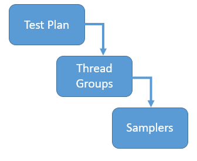

For more information regarding the JMX and its components please visit URL: https://jmeter.apache.org/usermanual/test_plan.html
In plugin, user can see this arrangement in the below structure:

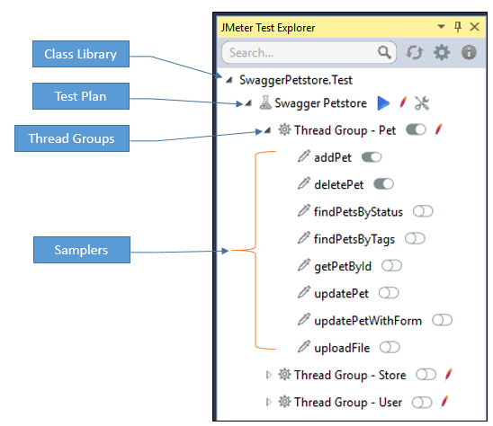

 `User Actions`:

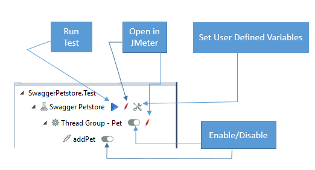

a.	 **Run Test**: Runs the test plan as configured at that state.

b.	 **Open in JMeter**: Will open the JMeter Application GUI with the JMX file against which it is clicked.

c.	 **Enable/Disable**: Sets the enable attribute to true or false for either thread group or sampler.

d.	 **Set User Defined Variables**: This can be used to set values to user defined variables defined in the JMX. ***These variables are prefixed by ${__P in the file***. An example of it is given below

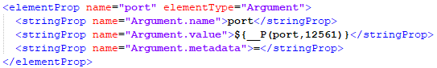

Once this icon is clicked a form window will open with default value populated in it. User can change these values and Save it in the file directly from the form. And new changes will start reflecting. This form window will look like below:

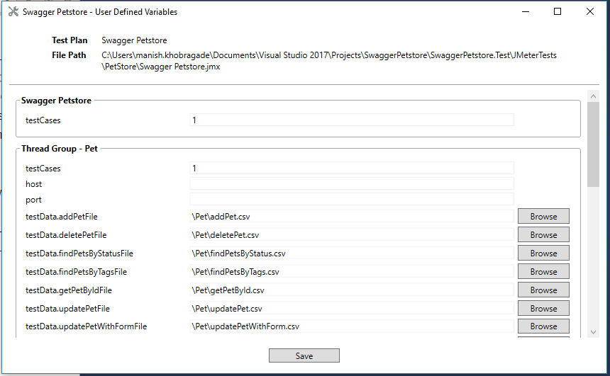

e.	 When **Run Test** action is performed on the test plan, process in background will start executing the test plan and will display the result in the window.

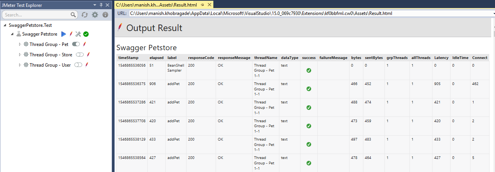

f.	A new action item is also visible at the rightmost corner with green tick.

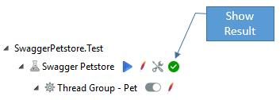

On clicking this Output CSV generated is brought to front in the application supported for reading csv files by the system (MS Excel, Notepad++). The output file name is in the format {OriginalFileName}-output-{DateTime}.csv and this file is saved in the same location as the test plan JMX file. An example of it can be viewed in below image.

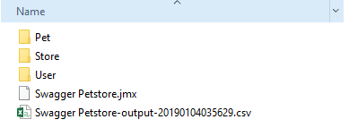

g.	This output result can be used by user for further purpose. User can validate if their services is up and running, analyze performance and load test result of this test, publish results etc.

**NOTE** :	JMeter Test Explorer is supported and tested on Visual Studio version 17(Professional & Enterprise). For earlier versions behavior may change while work is under progress to make it fully functional on earlier versions as well.

